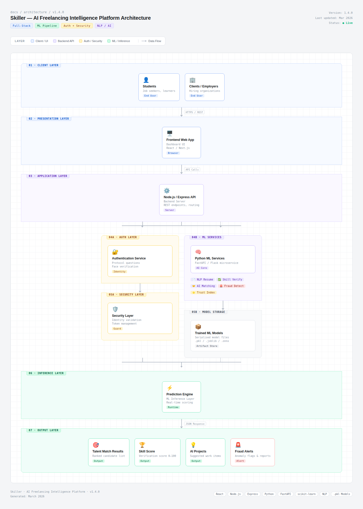

# Skiller — AI Freelancing Intelligence Platform

Skiller is an AI-driven freelancing intelligence platform designed to improve trust, skill validation, and data-driven decision-making in digital talent marketplaces.

The project originated from identifying trust gaps and inefficiencies in traditional freelancing ecosystems, where static reputation metrics and self-reported skills dominate hiring decisions. Skiller addresses this by integrating multiple machine learning models to evaluate credibility, predict job compatibility, detect anomalous behavior, and generate a dynamic trust index.

The system demonstrates applied ML engineering through trained models, evaluation metrics, and real-time inference integration within a backend architecture.

---

## Core AI Capabilities

- Resume intelligence using NLP-based feature extraction and classification  
- Skill verification through supervised ML models  
- Predictive job matching with compatibility scoring  
- Credibility and trust index modeling  
- Anomaly-based fraud detection using unsupervised learning  
- Real-time inference powered by integrated ML pipelines  

---

## Tech Stack

Frontend  
- HTML / CSS / JavaScript  
- Modern UI components

Backend  
- Node.js  
- Express.js

Machine Learning  
- Python  
- Scikit-learn  
- NLP feature extraction  
- Random Forest / Gradient Boosting models  
- Isolation Forest anomaly detection

Data Processing  
- Pandas  
- NumPy

Model Deployment  
- Joblib model persistence  
- Real-time inference pipelines

---

## System Architecture

Skiller follows a full-stack hybrid architecture integrating frontend interfaces, backend APIs, and dedicated machine learning microservices.

Web Application (User Interface)  
→ Node.js / Express Backend  
→ Python ML Services  
→ Trained ML Models (.pkl artifacts)  
→ Real-Time Prediction Output  

Training workflows are decoupled from inference services, enabling modular design, scalable integration, and clear separation between model development and deployment layers.

The platform follows a layered AI system architecture integrating a full-stack web application with machine learning microservices for intelligent freelancer evaluation and project matching.

---

## Machine Learning System

Skiller integrates multiple machine learning modules designed to evaluate freelancer credibility, analyze resumes, detect fraudulent activity, and match talent with projects.

The platform follows a hybrid architecture:

Frontend → Node.js / Express Backend → FastAPI ML Services → MongoDB Database → Model Inference Layer

MongoDB is used to store user profiles, freelancer activity data, project listings, and model-generated scores such as trust index and skill verification results.

Each machine learning model is trained independently and deployed through FastAPI-based ML microservices.

---

### ML Pipeline Improvements

The machine learning system uses a structured training pipeline with the following improvements:

- Stratified 5-Fold Cross Validation for reliable evaluation
- Multi-model comparison (RandomForest, SVM, Logistic Regression)
- Hyperparameter tuning using GridSearchCV
- Model versioning with performance-based filenames
- Automated model loading in the inference service
- Training metrics and reports saved for reproducibility

Each module generates a `model_report.json` containing evaluation metrics and parameters used during training.

---

### Model Modules

| Module | Purpose |
|------|------|
| **Resume Intelligence** | NLP-based resume classification and ATS scoring |
| **Talent Matching** | Project-to-freelancer compatibility scoring |
| **Skill Verification** | Code analysis using AST-based feature extraction |
| **Fraud Detection** | Detection of suspicious freelancer behavior |
| **Trust Score Model** | Predictive credibility scoring for freelancers |

All models are exposed through FastAPI endpoints and integrated with the Node.js backend.

---

### Dataset Overview

| Module | Dataset Type | Notes |
|------|------|------|
| Resume Analyzer | Synthetic resume dataset | Generated using realistic resume fragments and noise injection |
| Fraud Detector | Freelancing fraud behavior dataset | Includes 8 behavioral fraud indicators |
| Trust Scorer | Freelancer performance dataset | Based on platform activity signals |
| Skill Verifier | Code snippet dataset | AST features extracted from real code patterns |
| Talent Matcher | Text similarity dataset | Uses TF-IDF cosine similarity for project matching |

These datasets simulate real freelancing platform signals while maintaining reproducible training pipelines.

---

### Model Management

Models are stored using a versioned structure:

## Platform Preview

### Student Dashboard

### Client Dashboard

### AI Talent Matching Engine

### NLP Resume Analysis

### AI Skill Verification

### Face Authentication Security

### AI Suggested Projects

---

## Future Roadmap

Planned improvements for Skiller include:

- Graph-based skill knowledge networks for enhanced talent discovery
- Reinforcement learning powered recommendation engine
- Dynamic freelancer reputation modeling
- Real-time marketplace analytics
- Cloud deployment with scalable ML pipelines

- ---

## 🤝 Collaboration & Discussions

Skiller is an evolving project exploring how machine learning can improve trust, skill verification, and talent discovery in freelancing platforms.

I am always open to technical discussions, research ideas, and collaboration opportunities related to:

- AI-powered marketplaces
- recommendation systems
- fraud detection systems
- ML-driven talent evaluation
- scalable AI platform architecture

If you are interested in discussing the project, sharing ideas, or exploring potential collaborations, feel free to reach out.

  

You can also open an **Issue** in this repository for technical discussions or suggestions.

---
