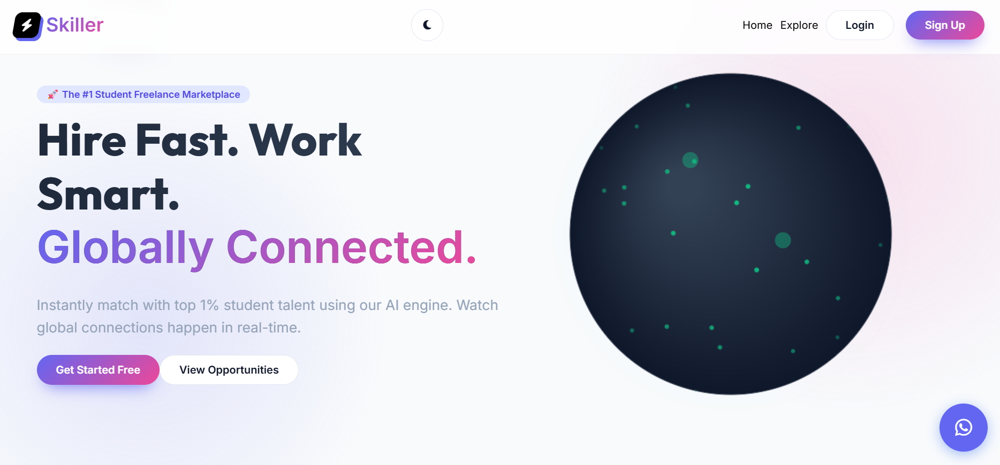
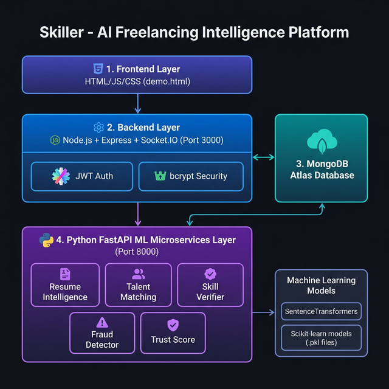

# 🚀 Skiller AI — Intelligent Freelancing Platform
 
> **AI-powered freelancer matching, trust scoring, and resume intelligence — replacing blind bidding with smart ML-driven discovery.**
 


 
---
 
## 📌 Problem Statement
 
Existing freelancing platforms like **Fiverr** and **Upwork** suffer from several deep-rooted problems:
 
- Oversaturated marketplaces where beginners rarely get visibility
- Poor freelancer–project matching mechanisms
- High commission rates eating into freelancer earnings
- Clients struggling to quickly find the right talent
- Reputation systems that fail to accurately reflect real skill
 
Skilled freelancers are often overlooked — not because of ability, but because of broken discovery systems. **Skiller AI was built to fix that.**
 
---
 
## 💡 Solution
 
Skiller introduces AI-powered intelligence layers on top of a freelancing marketplace — replacing blind bidding with smart, data-driven matching.
 
**Core innovations:**
 
- 🤖 AI-based freelancer and project matching
- 📄 Resume intelligence using NLP models
- 🧪 Skill verification via code analysis (AST)
- 🚨 Fraud detection for suspicious freelancer behavior
- ⭐ Trust scoring system for freelancer credibility
- 💼 Intelligent project recommendations
 
---

# 🖼 Platform Preview

### Main Dashboard


### Student Dashboard


### Client Dashboard


### AI Talent Matching Engine


### NLP Resume Verification


### Skill Verification Engine


### Face Authentication


### AI Suggested Projects


---

## 🏗 System Architecture
 
The platform follows a **hybrid full-stack AI architecture** combining traditional web services with machine learning inference layers.
 
```
┌─────────────────────────────────────────────────────┐
│                  Frontend (HTML/CSS/JS)              │
└────────────────────────┬────────────────────────────┘
                         │
┌────────────────────────▼────────────────────────────┐
│              Node.js / Express.js Backend            │
└──────────┬──────────────────────────┬───────────────┘
           │                          │
┌──────────▼──────────┐   ┌───────────▼───────────────┐
│   MongoDB Database  │   │  FastAPI ML Microservices  │
└─────────────────────┘   └───────────────────────────┘
                                      │
                      ┌───────────────▼──────────────┐
                      │     ML Model Inference Engine  │
                      │  (Resume / Matching / Fraud /  │
                      │   Trust Score / Skill Check)   │
                      └──────────────────────────────┘
```
 
---
 
## 🧠 Machine Learning Modules
 
| Module | Purpose |
|---|---|
| **Resume Intelligence** | NLP-based resume classification and ATS scoring |
| **Talent Matching** | Freelancer–project compatibility scoring (TF-IDF cosine similarity) |
| **Skill Verification** | Code analysis using AST feature extraction |
| **Fraud Detection** | Detection of suspicious freelancer behaviour |
| **Trust Score Model** | Predictive credibility scoring for freelancers |
 
### ML Pipeline Features
 
- Stratified 5-Fold Cross Validation
- Multi-model comparison (RandomForest, SVM, Logistic Regression)
- Hyperparameter tuning via GridSearchCV
- Versioned model files for reproducibility
- Automated model loading during inference
- Each training module outputs a `model_report.json` with evaluation metrics
 
---
 
## 📊 Dataset Overview
 
| Module | Dataset Type | Description |
|---|---|---|
| Resume Analyzer | Synthetic resume dataset | Generated from realistic resume fragments using domain templates |
| Fraud Detector | Behaviour dataset | Contains freelancing fraud indicators |
| Trust Scorer | Freelancer activity dataset | Platform credibility signals |
| Skill Verifier | Code snippet dataset | AST feature extraction from real code samples |
| Talent Matcher | Text similarity dataset | TF-IDF cosine similarity pairs |
 
> **Note on synthetic data:** Synthetic datasets were used to maintain reproducible training pipelines without exposing real user data. Generation scripts can be found in `/ml/data_generation/`.
 
---
 
## ⚙️ Tech Stack
 
| Layer | Technology |
|---|---|
| Frontend | HTML, CSS, JavaScript |
| Backend | Node.js, Express.js |
| ML Microservices | Python, FastAPI, Scikit-learn, SentenceTransformers |
| Database | MongoDB |
| DevOps | Git, GitHub, REST APIs |
 
---

# 🏗 System Architecture



The platform follows a **hybrid full-stack AI architecture** combining traditional web services with machine learning inference layers.

Core system layers include:

• Frontend dashboard interface  
• Node.js / Express backend APIs  
• FastAPI machine learning microservices  
• MongoDB database layer  
• ML model inference engine

This separation allows scalable integration of **AI decision systems within a freelancing marketplace platform**.

---

# ⚙️ Tech Stack

### Backend
• Node.js  
• Express.js  

### Machine Learning
• Python  
• Scikit-learn  
• FastAPI  
• SentenceTransformers  

### Database
• MongoDB  

### Frontend
• HTML  
• CSS  
• JavaScript  

### Tools
• Git & GitHub  
• REST APIs  
• JSON communication  

---

# 📈 Future Roadmap

Planned improvements for Skiller include:

• Deep learning-based skill verification  
• AI proposal generation for freelancers  
• Advanced freelancer recommendation systems  
• Secure payment gateway integration  
• Blockchain-based reputation verification  
• Automated talent discovery systems

---

# 🤝 Collaboration & Contact

Skiller is currently under active development.

If you are interested in **collaboration, research discussions, or startup opportunities**, feel free to connect.

[](https://www.linkedin.com/in/abhiram-settybalija-48a58035b)

[](mailto:abhiram07may@gmail.com)

---

# ⭐ Support

If you find this project interesting, consider giving the repository a ⭐ on GitHub.
