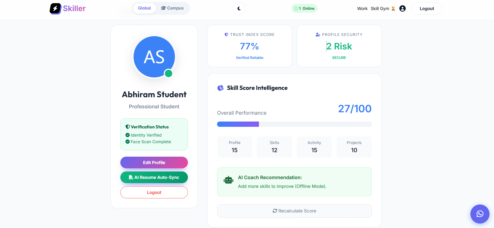
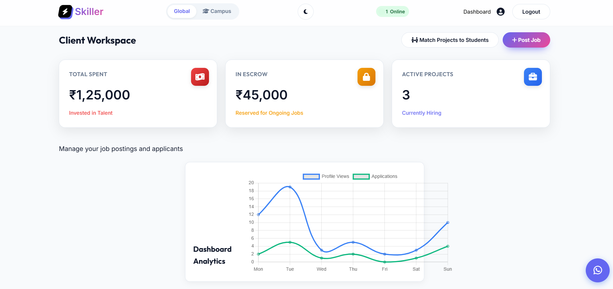
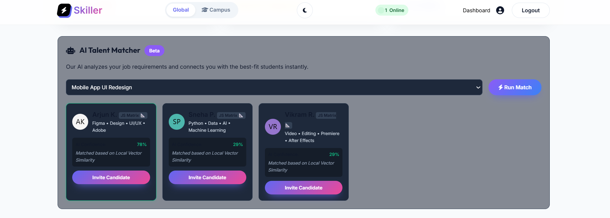
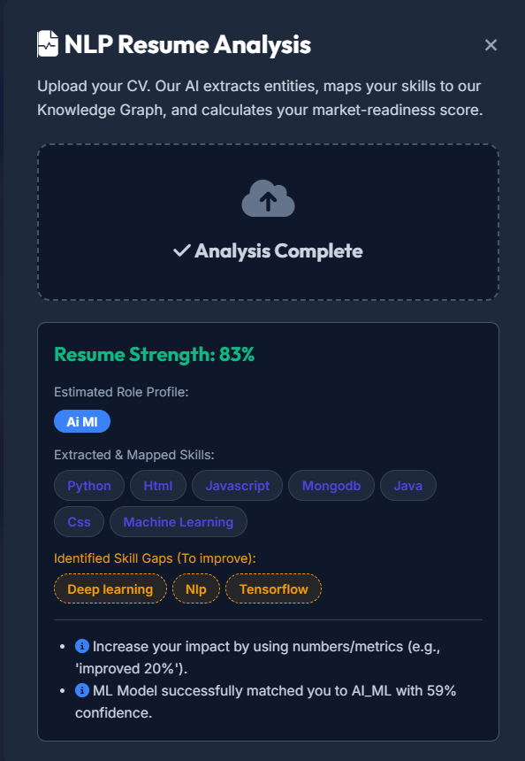
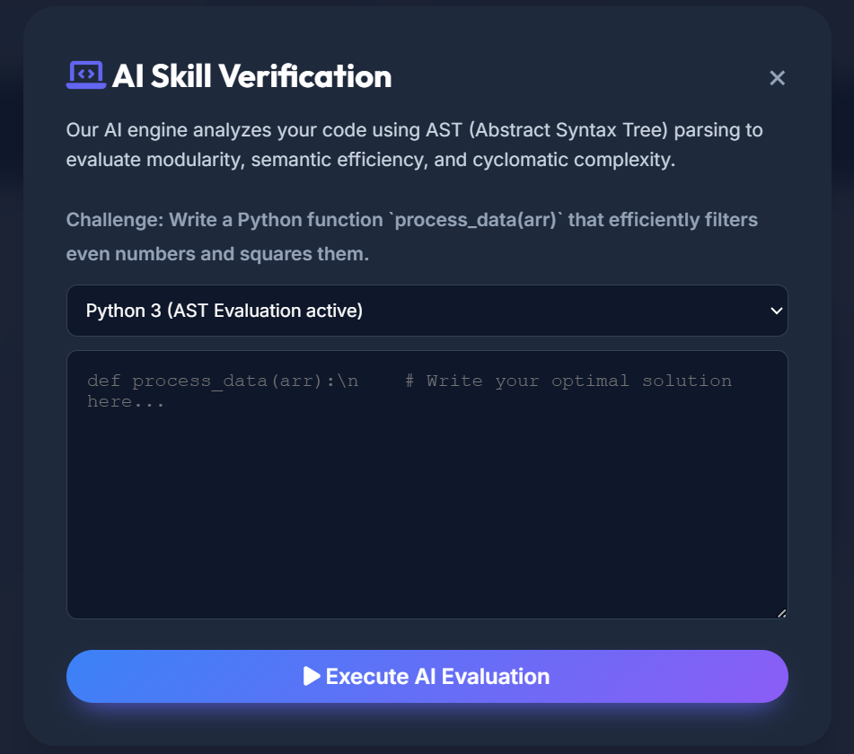
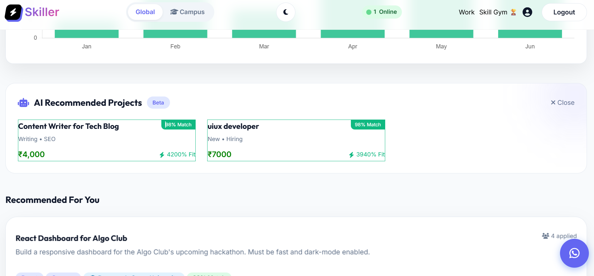

# Skiller — AI Freelancing Intelligence Platform

Skiller is an AI-driven freelancing intelligence platform designed to improve trust, skill validation, and data-driven decision-making in digital talent marketplaces.

The project originated from identifying trust gaps and inefficiencies in traditional freelancing ecosystems, where static reputation metrics and self-reported skills dominate hiring decisions. Skiller addresses this by integrating multiple machine learning models to evaluate credibility, predict job compatibility, detect anomalous behavior, and generate a dynamic trust index.

The system demonstrates applied ML engineering through trained models, evaluation metrics, and real-time inference integration within a backend architecture.

---

## Core AI Capabilities

- Resume intelligence using NLP-based feature extraction and classification  
- Skill verification through supervised ML models  
- Predictive job matching with compatibility scoring  
- Credibility and trust index modeling  
- Anomaly-based fraud detection using unsupervised learning  
- Real-time inference powered by integrated ML pipelines  

---

---

## Tech Stack

Frontend  
- HTML / CSS / JavaScript  
- Modern UI components

Backend  
- Node.js  
- Express.js

Machine Learning  
- Python  
- Scikit-learn  
- NLP feature extraction  
- Random Forest / Gradient Boosting models  
- Isolation Forest anomaly detection

Data Processing  
- Pandas  
- NumPy

Model Deployment  
- Joblib model persistence  
- Real-time inference pipelines

## System Architecture

Skiller follows a full-stack hybrid architecture integrating frontend interfaces, backend APIs, and dedicated machine learning microservices.

Web Application (User Interface)  
→ Node.js / Express Backend  
→ Python ML Services  
→ Trained ML Models (.pkl artifacts)  
→ Real-Time Prediction Output  

Training workflows are decoupled from inference services, enabling modular design, scalable integration, and clear separation between model development and deployment layers.

---

## Platform Preview

### Student Dashboard

### Client Dashboard

### AI Talent Matching Engine

### NLP Resume Analysis

### AI Skill Verification

### Face Authentication Security

### AI Suggested Projects

---

## Future Roadmap

Planned improvements for Skiller include:

- Graph-based skill knowledge networks for enhanced talent discovery
- Reinforcement learning powered recommendation engine
- Dynamic freelancer reputation modeling
- Real-time marketplace analytics
- Cloud deployment with scalable ML pipelines
